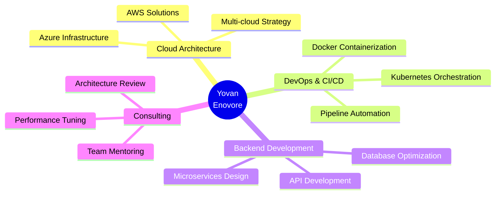

<div align="center">

<!-- Header animado -->


<!-- Typing SVG -->
<p align="center">
  <a href="https://git.io/typing-svg">
    
  </a>
</p>

<!-- Badges profesionales -->
<p align="center">
  
  
  
</p>

<!-- Social Links con iconos mejorados -->
<p align="center">
  <a href="https://linkedin.com/in/yovanenovore">
    
  </a>
  <a href="https://github.com/ynvYauneEnovore">
    
  </a>
  <a href="mailto:contact@yovanenovore.dev">
    
  </a>
</p>

---

## 🎯 About Me

```yaml
name: Yovan Enovore
role: Senior Software Engineer & Cloud Architect
location: 🌍 Available Worldwide
experience: 7+ years
focus: 
  - Cloud Native Architecture
  - Microservices & Containers
  - DevOps & CI/CD
  - High Availability Systems
current_status: Building scalable solutions for 3M+ users
```


</div>

---

## 🛠️ Tech Stack & Expertise

<div align="center">

### ☁️ Cloud & DevOps
<p>
  
</p>

### 💻 Languages & Frameworks
<p>
  
</p>

### 🗄️ Databases & Tools
<p>
  
</p>

### 🔧 Development Tools
<p>
  
</p>

</div>

---

## 📊 GitHub Statistics

<div align="center">
  


<!-- GitHub Activity Graph -->


</div>

---

## 🚀 Featured Projects

<div align="center">

<table>
<tr>
<td width="50%">

### 📡 VerifyTrack
 

**Real-time data processing platform**
- 🐳 Docker & Kubernetes orchestration
- 📈 Auto-scaling microservices
- 🎯 Telecom industry optimization
- ⚡ 99.9% uptime SLA

</td>
<td width="50%">

### 🔄 SyncOptimice
 

**Enterprise data synchronization**
- 🔧 Microservices architecture
- 🚀 CI/CD pipeline automation
- 🔄 Real-time data sync
- 📦 Containerized deployment

</td>
</tr>

<tr>
<td width="50%">

### 🏥 MedTrack
 

**Medical data management system**
- 💊 HIPAA compliant infrastructure
- 🔐 High security & encryption
- 📊 Advanced analytics dashboard
- 🌐 Multi-region deployment

</td>
<td width="50%">

### 🌟 More Projects


**Explore my work**
- 💼 Enterprise solutions
- 🔬 R&D prototypes
- 🎨 Open source contributions
- 📚 Technical documentation

[View Portfolio →](https://github.com/ynvYauneEnovore)

</td>
</tr>
</table>

</div>

---

## 🏆 Achievements & Impact

<div align="center">


| Metric | Achievement | Details |
|:---:|:---:|:---|
| 🌟 | **23+** | Open source contributions |
| 👥 | **3M+** | Monthly active users |
| 🚀 | **73+** | Production environments |
| ⚡ | **+40%** | Performance improvement |
| 🏅 | **Top 11%** | StackOverflow ranking |
| 💡 | **99.9%** | Average uptime |

<!-- Holopin Badges -->
<a href="https://holopin.io/@ynvyauneenovore">
  
</a>

</div>

---

## 📈 Contribution Activity

<div align="center">


</div>

---

## 💼 Professional Services

<div align="center">



</div>

---

## 🎓 Certifications & Skills

<div align="center">

### 🎯 Core Competencies

```diff
+ Cloud Native Architecture (AWS, Azure, GCP)
+ Container Orchestration (Kubernetes, Docker Swarm)
+ Infrastructure as Code (Terraform, Ansible)
+ CI/CD Pipelines (Jenkins, GitLab CI, GitHub Actions)
+ Microservices & Event-Driven Architecture
+ High Availability & Disaster Recovery
+ Performance Optimization & Scalability
+ Security Best Practices & Compliance
```

### 📚 Currently Learning
<p>
  
  
  
</p>

</div>

---

## 📫 Let's Connect!

<div align="center">


### 🤝 Open to Collaboration

I'm always interested in:
- 🚀 Innovative cloud-native projects
- 💡 Open source contributions
- 🎯 Consulting opportunities
- 📚 Knowledge sharing & mentoring

### 📧 Get in Touch

<a href="https://linkedin.com/in/yovanenovore">
  
</a>
<a href="mailto:contact@yovanenovore.dev">
  
</a>

---

### 💭 Quote of the Day


---

### 👁️ Profile Views


</div>

---

<div align="center">
  <i>⭐️ From <a href="https://github.com/ynvYauneEnovore">ynvYauneEnovore</a> - Building the future, one commit at a time</i>
</div>
