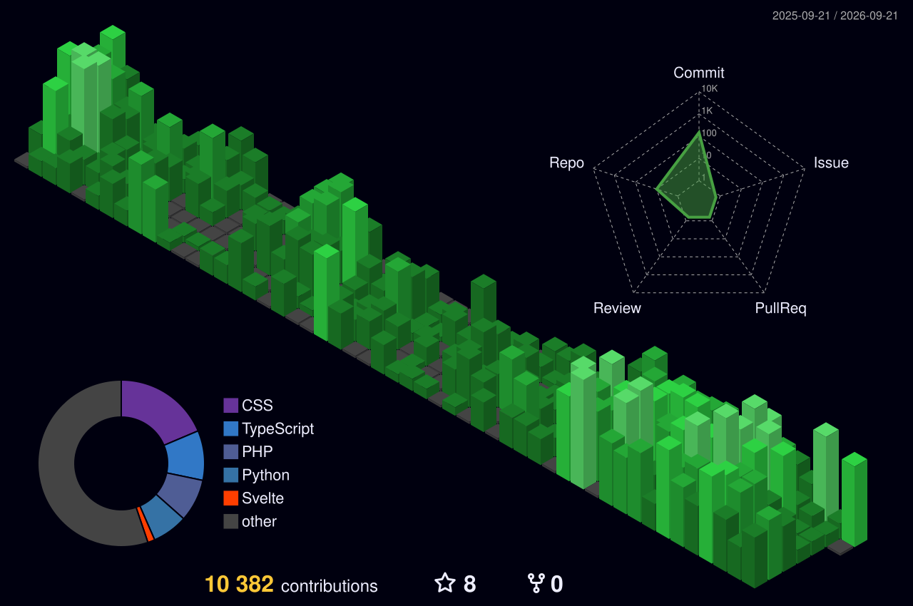

<div align="center">


<a href="https://git.io/typing-svg">
  
</a>

<a href="https://git.io/typing-svg">
  
</a>

<br/><br/>

<a href="https://git.io/typing-svg">
  
</a>

<br/><br/>

<p>
  
  &nbsp;
  
  &nbsp;
  
</p>

<p>
  <a href="https://yovanenovore.space" target="_blank">
    
  </a>
  &nbsp;
  <a href="https://linkedin.com/in/yovanenovore" target="_blank">
    
  </a>
  &nbsp;
  <a href="https://github.com/ynvYauneEnovore" target="_blank">
    
  </a>
  &nbsp;
  <a href="mailto:yovanuxf@gmail.com">
    
  </a>
  &nbsp;
  <a href="https://user-badge.committers.top/bolivia_private/ynvYauneEnovore">
    
  </a>
</p>

[](https://user-badge.committers.top/bolivia_private/ynvYauneEnovore)

</div>

---

<div align="center">

```
ABOUT
```

</div>

```yaml
profile:
  name: Yovan R. Enovore
  role: DevOps Architect / Platform Engineer
  location: Sucre, Bolivia
  website: yovanenovore.space
  experience: 4+ years in production environments

core_competencies:
  cloud_infrastructure:
    - AWS / Azure / GCP — Multi-region deployments
    - Kubernetes / EKS / AKS — Container orchestration
    - Terraform / Pulumi / Ansible — Infrastructure as Code
    - CloudFormation / ARM Templates — Native provisioning
  security_operations:
    - Zero-Trust Architecture — Identity-aware proxying
    - Threat Detection & Response — Automated incident handling
    - Penetration Testing — Offensive security assessments
    - Network Security — Firewall, IDS/IPS, VPN
  platform_engineering:
    - CI/CD — GitHub Actions, GitLab CI, Jenkins
    - Observability — Grafana, Prometheus, ELK Stack, Datadog
    - Message Brokers — RabbitMQ, Apache Kafka
    - GitOps — ArgoCD, Flux
  server_administration:
    - Linux Systems — RHEL, Debian, Ubuntu, Arch
    - DNS Infrastructure — BIND, Unbound, DoH
    - Load Balancing — HAProxy, Traefik, NGINX
    - Containerization — Docker, Podman

languages: [Python, Go, Rust, C, C++, TypeScript, JavaScript, Java, C#, PHP]
databases: [PostgreSQL, MySQL, MongoDB, Redis, SQLite]
status: AVAILABLE
```

---

<div align="center">

```
CURRENT FOCUS
```

<br/>

<a href="https://git.io/typing-svg">
  
</a>

<p>
  
  &nbsp;
  
  &nbsp;
  
</p>

<br/>

</div>

---

<div align="center">

```
TECHNOLOGY STACK
```

<br/>

<details open>
<summary>&nbsp;▸ <b>CLOUD & INFRASTRUCTURE</b>&nbsp;&nbsp;<code>providers · servers · networking</code></summary>
<br/>
<p>
  
</p>
<p>
  
</p>
<p>
  
  
  
</p>
<p>
  
  &nbsp;
  
  &nbsp;
  
  &nbsp;
  
</p>
<p>
  
  
  
</p>
</details>

<details open>
<summary>&nbsp;▸ <b>DEVOPS & ORCHESTRATION</b>&nbsp;&nbsp;<code>9 platforms</code></summary>
<br/>
<p>
  
</p>
</details>

<details open>
<summary>&nbsp;▸ <b>SECURITY</b>&nbsp;&nbsp;<code>offensive · defensive · standards</code></summary>
<br/>
<p>
  
  &nbsp;
  
  &nbsp;
  
  &nbsp;
  
</p>
<p>
  
  &nbsp;
  
  &nbsp;
  
  &nbsp;
  
  &nbsp;
  
</p>
<p>
  
  &nbsp;
  
  &nbsp;
  
  &nbsp;
  
</p>
</details>

<details open>
<summary>&nbsp;▸ <b>DEVELOPMENT STACK</b>&nbsp;&nbsp;<code>languages · frameworks · data · tools</code></summary>
<br/>
<p>
  
</p>
<p>
  
</p>
<p>
  
</p>
<p>
  
</p>
<p>
  
</p>
</details>

<details open>
<summary>&nbsp;▸ <b>CERTIFICATIONS</b>&nbsp;&nbsp;<code>verified</code></summary>
<br/>
<p>
  
  &nbsp;
  
  &nbsp;
  
</p>
<p>
  
  &nbsp;
  
  &nbsp;
  
</p>
</details>

</div>

---

<div align="center">

```
GITHUB METRICS
```

<br/>


<br/><br/>


<br/><br/>


<br/><br/>


<br/><br/>

<p>
  
  &nbsp;
  
  &nbsp;
  
</p>

<br/>

</div>

---

<div align="center">

```
API TELEMETRY
```

<br/>

<p>
  
  &nbsp;
  
</p>

<p>
  
  &nbsp;
  
  &nbsp;
  
  &nbsp;
  
</p>

<br/>


<br/><br/>

</div>

---

<div align="center">

```
ACHIEVEMENTS
```

<br/>

<a href="https://holopin.io/@ynvyauneenovore">
  
</a>

<br/><br/>

</div>

---

<div align="center">

```
WAKATIME METRICS
```

<br/>

<!--START_SECTION:waka-->
<!--END_SECTION:waka-->

<br/><br/>

</div>

---

<div align="center">

```
RECENT ACTIVITY
```

<br/>

<!--START_SECTION:activity-->
<!--END_SECTION:activity-->

<br/><br/>

</div>


<div align="center">

```
CONTRIBUTION MAP
```

<br/>

<picture>
  <source media="(prefers-color-scheme: dark)" srcset="https://raw.githubusercontent.com/ynvYauneEnovore/ynvYauneEnovore/output/github-snake-dark.svg" />
  <source media="(prefers-color-scheme: light)" srcset="https://raw.githubusercontent.com/ynvYauneEnovore/ynvYauneEnovore/output/github-snake.svg" />
  
</picture>

<br/><br/>

</div>

---

<div align="center">

```
3D CONTRIBUTION GRAPH
```

<br/>

<picture>
  <source media="(prefers-color-scheme: dark)" srcset="./profile-3d-contrib/profile-night-green.svg" />
  <source media="(prefers-color-scheme: light)" srcset="./profile-3d-contrib/profile-green-animate.svg" />
  
</picture>

<br/><br/>

</div>

---

<div align="center">

```
ADVANCED METRICS
```

<br/>


<br/><br/>

</div>

---

<div align="center">

<br/>

<a href="https://git.io/typing-svg">
  
</a>

<br/><br/>

```
 ╔══════════════════════════════════════════════════════════════╗
 ║                                                              ║
 ║   "Infrastructure is code. Code is architecture.             ║
 ║    Architecture is control."                                  ║
 ║                                                              ║
 ╚══════════════════════════════════════════════════════════════╝
```

<br/>

</div>


