<div align="center">

<!-- Header con mejor espaciado -->


<p align="center">
  <a href="https://git.io/typing-svg">
    
    
  </a>
</p>
<br/>

<!-- Badges profesionales mejorados -->
<p align="center">
  
  
  
  
</p>

<br/>

<!-- Social Links optimizados -->
<p align="center">
  <a href="https://linkedin.com/in/yovanenovore" target="_blank">
    
  </a>
  <a href="https://github.com/ynvYauneEnovore" target="_blank">
    
  </a>
  <a href="mailto:yovanuxf@gmail.com">
    
  </a>
  <a href="https://stackoverflow.com/users/ynvYauneEnovore" target="_blank">
    
  </a>
</p>

<br/>

---

<br/>

## 🎯 About Me

<br/>

```yaml
name: Yovan R. Enovore
role: Software Engineer & Cloud Architect
location: 🌍 Remote - Available Worldwide of 🇧🇴 Bolivia 
experience: 4+ years in enterprise solutions
specialization:
  - ☁️  Cloud Native Architecture (AWS, Azure, GCP)
  - 🐳 Container Orchestration (Kubernetes, Docker)
  - 🔄 CI/CD & DevOps Automation
  - 🏗️  Microservices & Scalable Systems
  - 📊 High Availability Infrastructure
impact:
  - 18+ monthly active users
  - 13+ production environments managed
  - 40% performance improvement achieved
  - 99.9% average uptime maintained
```

<br/>


<br/>

</div>

---

## 🛠️ Tech Stack & Expertise

<div align="center">

<br/>

### ☁️ Cloud & Infrastructure
<p>
  
</p>

### 🐳 DevOps & Orchestration
<p>
  
</p>

### 💻 Programming Languages
<p>
  
</p>

### 🎨 Frontend & Frameworks
<p>
  
</p>

### 🔧 Backend & APIs
<p>
  
</p>

### 🗄️ Databases & Cache
<p>
  
</p>

### 🔗 Message Brokers & Streaming
<p>
  
</p>

### 🔨 Development Tools
<p>
  
</p>

<br/>

</div>

---

## 📊 GitHub Analytics

<div align="center">

<br/>

<!-- Stats Cards con tema consistente -->


<br/><br/>

<!-- Top Languages -->


<br/><br/>

<!-- Activity Graph mejorado -->


<br/><br/>

<!-- Profile Summary Cards -->


<br/>


<br/><br/>

</div>

---

## 🚀 Featured Projects

<div align="center">

<br/>

<table>
<tr>
<td width="50%" valign="top">

<h3 align="center">📡 VerifyTrack</h3>

<div align="center">

 


</div>

<br/>

**Real-time Data Processing Platform**

- 🐳 Docker containerization
- ☸️ Kubernetes orchestration  
- 📈 Auto-scaling microservices
- 🎯 Telecom industry optimization
- ⚡ High-performance processing
- 🔄 Event-driven architecture

<br/>

**Tech Stack:**
<p align="center">
  
  
  
  
</p>

</td>
<td width="50%" valign="top">

<h3 align="center">🔄 SyncOptimice</h3>

<div align="center">

 


</div>

<br/>

**Enterprise Data Synchronization**

- 🔧 Microservices architecture
- 🚀 CI/CD pipeline automation
- 🔄 Real-time data sync
- 📦 Containerized deployment
- 🔐 End-to-end encryption
- 📊 Advanced monitoring

<br/>

**Tech Stack:**
<p align="center">
  
  
  
  
</p>

</td>
</tr>

<tr>
<td width="50%" valign="top">

<h3 align="center">🏥 MedTrack</h3>

<div align="center">

 


</div>

<br/>

**Medical Data Management System**

- 💊 HIPAA compliant infrastructure
- 🔐 Advanced security & encryption
- 📊 Real-time analytics dashboard
- 🌐 Multi-region deployment
- 🔄 Automated backups
- 📱 Mobile & web platforms

<br/>

**Tech Stack:**
<p align="center">
  
  
  
  
</p>

</td>
<td width="50%" valign="top">

<h3 align="center">🌟 Open Source & More</h3>

<div align="center">


</div>

<br/>

**Professional Portfolio**

- 💼 Enterprise solutions
- 🔬 Research & Development
- 🎨 Open source contributions
- 📚 Technical documentation
- 🛠️ DevOps tools & scripts
- 🌐 Cloud infrastructure templates

<br/>

**Explore More:**
<p align="center">
  <a href="https://github.com/ynvYauneEnovore?tab=repositories">
    
  </a>
</p>

</td>
</tr>
</table>

<br/>

</div>

---

## 🏆 Achievements & Impact Metrics

<div align="center">

<br/>


<br/><br/>

| 🎯 Metric | 📊 Achievement | 📝 Details |
|:---:|:---:|:---|
| ⭐ **Open Source** | **23+** | Active contributions to GitHub projects |
| 👥 **User Impact** | **18+** | Monthly active users across platforms |
| 🚀 **Infrastructure** | **13+** | Production environments managed |
| ⚡ **Performance** | **+40%** | Average improvement in delivery time |
| 🏅 **Ranking** | **Top 11%** | StackOverflow developer ranking |
| 💯 **Reliability** | **99.9%** | Average system uptime maintained |
| 🔧 **Automation** | **85%** | CI/CD pipeline automation rate |
| 🌐 **Scale** | **Multi-region** | Global infrastructure deployment |

<br/>

<!-- Holopin Badges -->
<a href="https://holopin.io/@ynvyauneenovore">
  
</a>

<br/><br/>

<!-- GitHub Trophies -->


<br/>

</div>

---

## 📈 Contribution Timeline

<div align="center">

<br/>

<!-- 3D Contribution Graph -->


<br/>

</div>

---

## 💼 Professional Services & Expertise

```mermaid
mindmap
  root((Yovan<br/>Enovore<br/>Senior Engineer))
    ☁️ Cloud Architecture
      AWS Solutions Architect
      Azure Infrastructure
      GCP Implementation
      Multi-Cloud Strategy
      Cost Optimization
    🐳 DevOps & CI/CD
      Kubernetes Expert
      Docker Specialist
      GitOps Workflows
      Pipeline Automation
      Infrastructure as Code
    💻 Backend Development
      Microservices Design
      API Development
      Database Architecture
      Performance Tuning
      Security Best Practices
    🎯 Consulting Services
      Architecture Review
      System Optimization
      Team Mentoring
      Technical Leadership
      Code Quality Audits
```

<div align="center">

<br/>



<br/>

</div>

---

## 🎓 Skills & Technologies Matrix

<div align="center">

<br/>

### 🔥 Core Competencies

```diff
@@  Cloud & Infrastructure  @@
+ AWS (EC2, ECS, EKS, Lambda, S3, RDS, CloudFormation)
+ Azure (AKS, App Services, Functions, DevOps, Storage)
+ GCP (GKE, Cloud Run, Cloud Functions, BigQuery)
+ Multi-cloud architecture & migration strategies

@@  Container & Orchestration  @@
+ Docker (Multi-stage builds, optimization, security)
+ Kubernetes (Helm, Operators, Service Mesh, Monitoring)
+ Docker Swarm, Docker Compose
+ Container security & best practices

@@  CI/CD & Automation  @@
+ Jenkins, GitLab CI/CD, GitHub Actions, CircleCI
+ ArgoCD, Flux (GitOps)
+ Terraform, Ansible, Pulumi
+ Automated testing & deployment pipelines

@@  Backend & APIs  @@
+ RESTful APIs, GraphQL, gRPC
+ Microservices architecture
+ Event-driven systems (Kafka, RabbitMQ)
+ High-performance scalable systems

@@  Databases & Storage  @@
+ PostgreSQL, MySQL, MongoDB, Redis
+ Elasticsearch, Cassandra, DynamoDB
+ Database optimization & sharding
+ Backup & disaster recovery strategies

@@  Monitoring & Observability  @@
+ Prometheus, Grafana, ELK Stack
+ Distributed tracing (Jaeger, Zipkin)
+ APM tools (New Relic, DataDog)
+ SRE practices & incident management
```

<br/>

### 📚 Currently Exploring

<p>
  
  
  
  
  
</p>

<br/>

</div>

---

## 📫 Let's Connect & Collaborate!

<div align="center">

<br/>


<br/><br/>

### 🤝 Open to Opportunities

<br/>

I'm always interested in:

| 🚀 | 💡 | 🎯 | 📚 |
|:---:|:---:|:---:|:---:|
| **Innovative Projects** | **Open Source** | **Consulting** | **Mentoring** |
| Cloud-native solutions | Community contributions | Architecture review | Knowledge sharing |
| Scalable systems | Tool development | Performance optimization | Team leadership |

<br/>

### 📧 Get in Touch

<br/>

<a href="https://linkedin.com/in/yovanenovore" target="_blank">
  
</a>
<a href="mailto:yovanuxf@gmail.com">
  
</a>
<a href="https://github.com/ynvYauneEnovore" target="_blank">
  
</a>
<a href="https://stackoverflow.com/users/ynvYauneEnovore" target="_blank">
  
</a>

<br/><br/>

---

<br/>

### 💭 Developer Quote


<br/>

---

<br/>

### 📊 Profile Analytics

<p align="center">
  
  
  
</p>

<br/>


</div>

---

<div align="center">
  
<br/>

**💡 "Building scalable solutions, one commit at a time"**

<br/>


<br/>

<sub>⭐️ From [ynvYauneEnovore](https://github.com/ynvYauneEnovore) | Last updated: 2025</sub>

</div>
